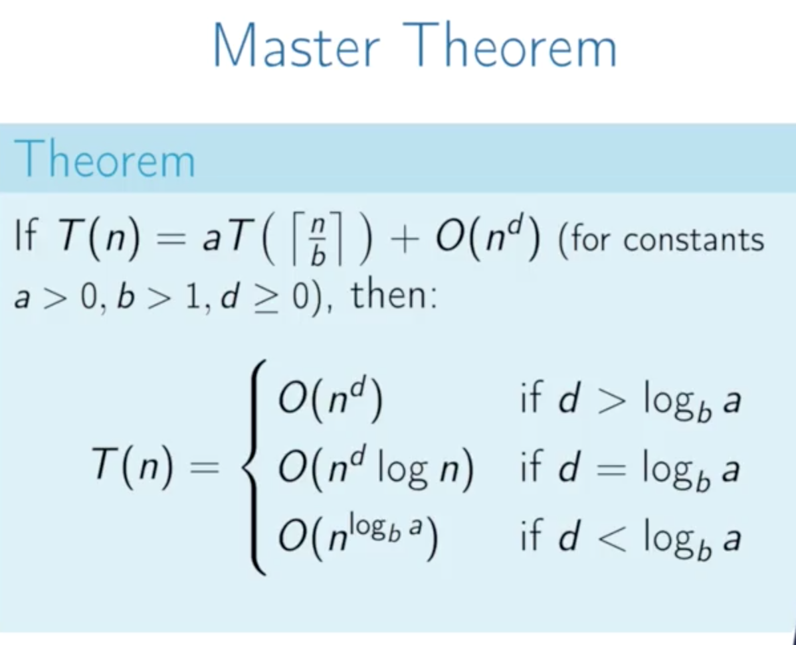
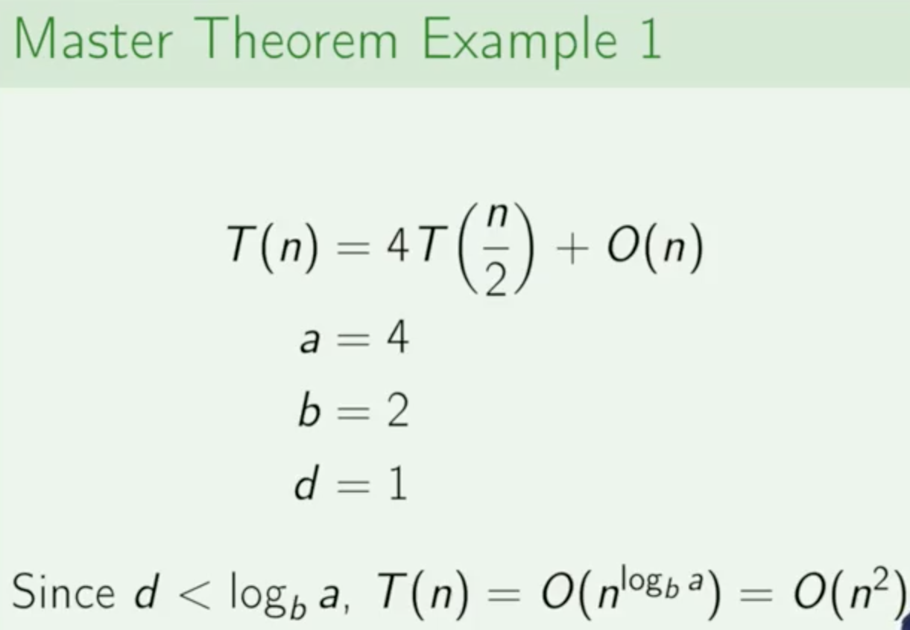
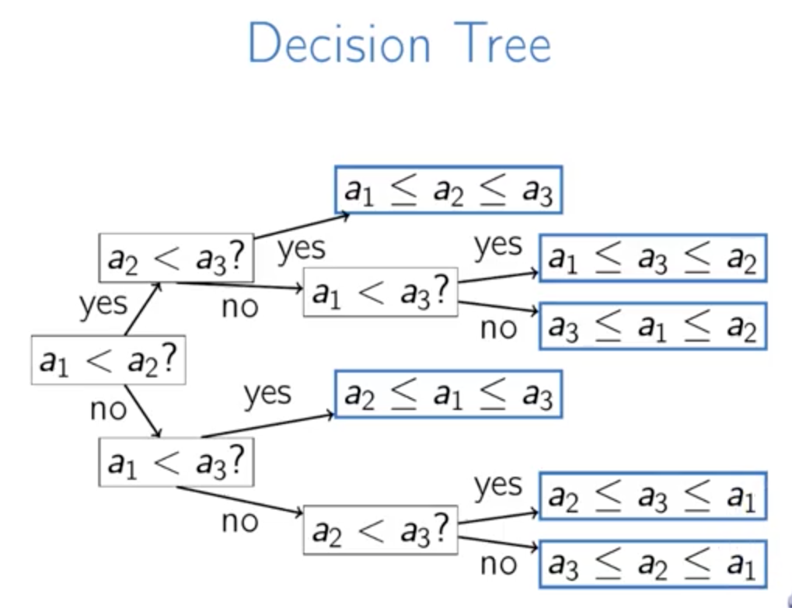
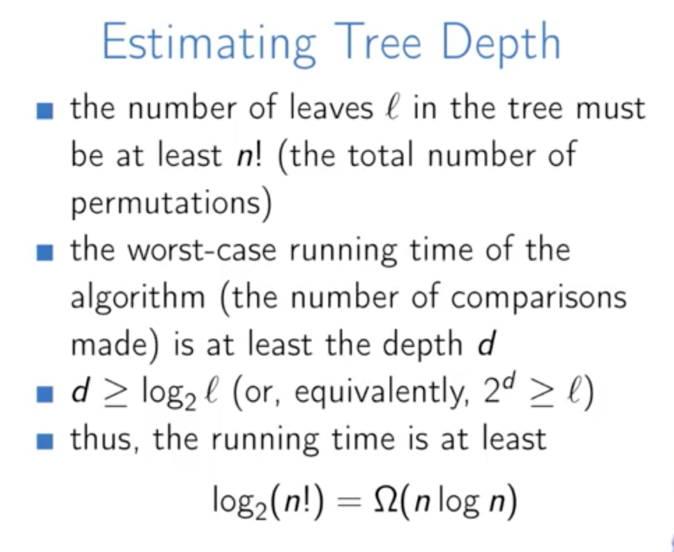
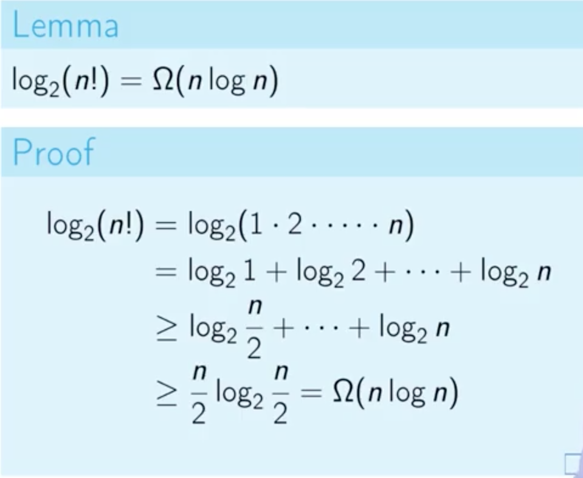
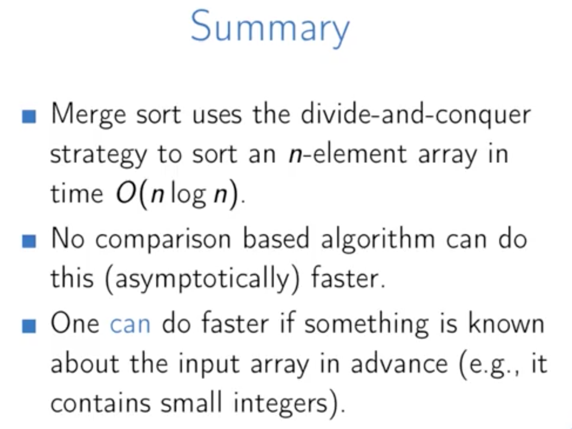

Week 4  : Divid And Conquer Algorithm
======

Divid And Conquer Algorithm:
> 1. **Divid**: Break into **non-overlapping** subproblems of the **same type**
> 2. Solve subproblem
> 3. Combine Results

> **recurrence relation:** is an equation recursively **defining** a sequence of values

> 有没有发现, 它和greedy algorithm 还是有些相像的，都是可以把问题分解成同等类型的小问题， 区别在于greedy algorithm不需要 combine result，因为它是在筛选

Steps:
> 1. Create a recursive solution
> 2. Define a corresponding recurrence relation, T
> 3. Determine T(n): worst-case runtime
> 4. Optionally, create iterative solution

binary search time-complex:
> T(n) = T(n/2) + T1

*** 

#### Master Theorem

  

#### Sorting Problem

Lemma:
> Any comparison based sorting algorithm performs Ω(nlogn) comparisons in the worst case to sort n objects

In other words
> For any comparison based sorting algorithm, there exists an array A[1...n] such that the algorithm performs at least Ω(nlogn) comparisions to srot A.

 

#### Non comparison based sorting algorithm

这个其实就是 bitmap 的思想呗

summary

