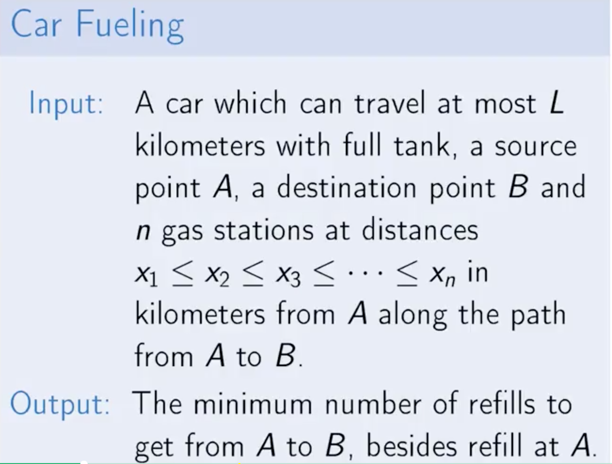
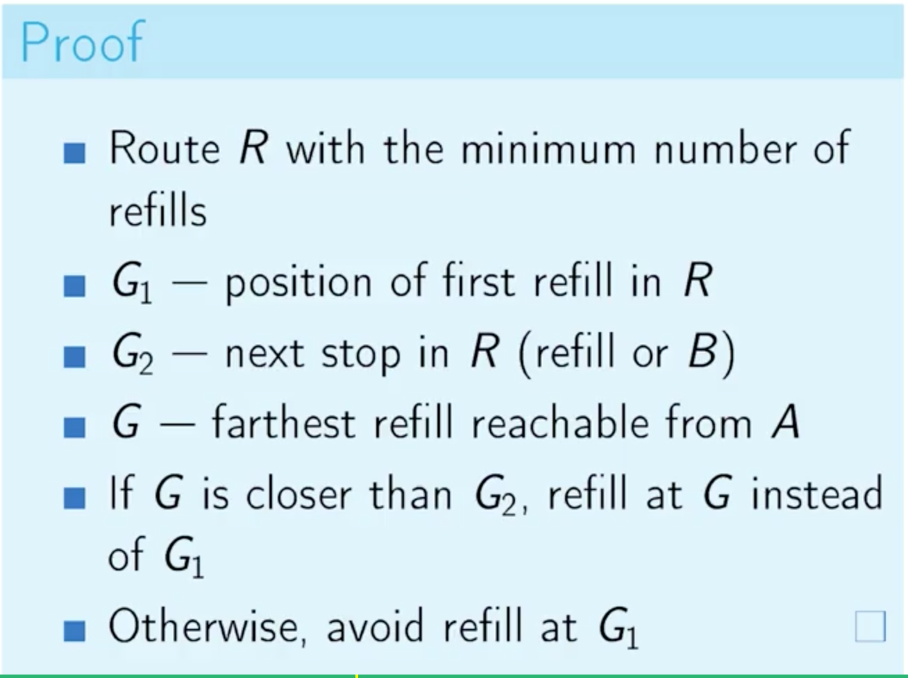
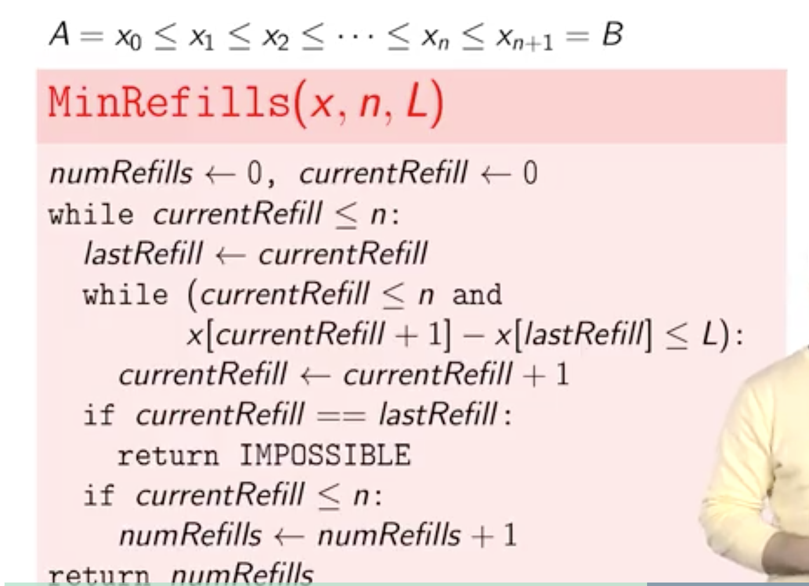
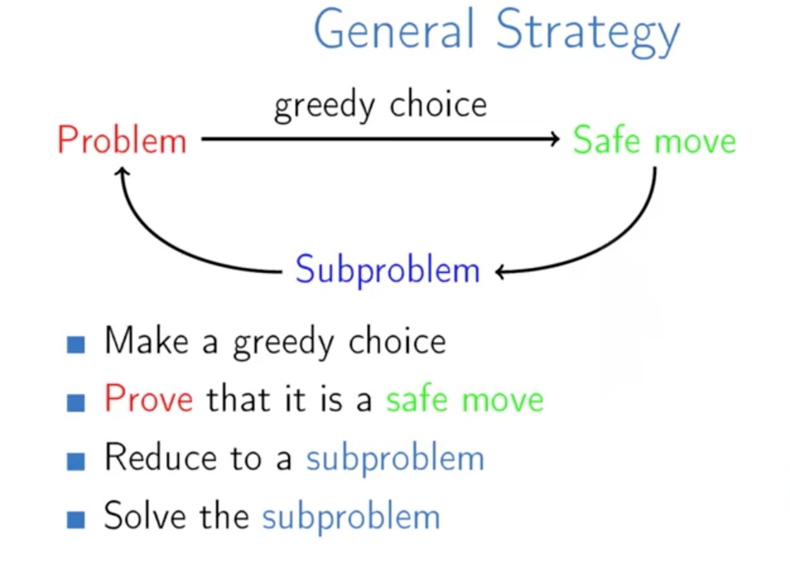

Week 4  : Divid And Conquer Algorithm
======

Divid And Conquer Algorithm:
> 1. **Divid**: Break into **non-overlapping** subproblems of the **same type**
> 2. Solve subproblem
> 3. Combine Results

> **recurrence relation:** is an equation recursively **defining** a sequence of values

> 有没有发现, 它和greedy algorithm 还是有些相像的，都是可以把问题分解成同等类型的小问题， 区别在于greedy algorithm不需要 combine result，因为它是在筛选

Steps:
> 1. Create a recursive solution
> 2. Define a corresponding recurrence relation, T
> 3. Determine T(n): worst-case runtime
> 4. Optionally, create iterative solution

greedy algorithm 是串行的解决子问题，而每个子问题的解都是当前看来最优的

给定一个问题，我怎么判读是否该用贪心算法？
> 往往是有多个选择，而且需要迭代多次
> 还是需要判断是否满足 safe-move
> 我们要先看看是不是需要对数据进行排序

### Greedy Algorithm
#### Definition

- **Subproblem:** is a similar problem of smaller size;
- **Safe Move:** A greedy choice is called safe move if there is an optimal solution consistent with the first move

#### Example：MinRefill

- LargestNumber(3,9,5,9,7,1) = '9' + LargestNumber(3,5,9,7,1)
- Min number of refills(A,B)  = first refile at G + Min number of refills(G,B) 

MinRefill Problem:

<video id="video" controls="" preload="none" width="500"
      <source id="mp4" src="videos/car_refill.mp4" type="video/mp4">
      
Your user agent does not support the HTML5 Video element.

</video>

 
 

|  |   |

其实右图中的证明就是:
    
    从A开始，找到一个距离最长的G
    1. 如果G没到终点，那就在G加油；
    2. 如果G是终点，那就不用加油了，这个为了处理边界，即终点

如下是证明过程:

<table>
    <tr>
        <td>
            

            右图中，和n有关的是 numRefills 和 currentrRefill:
            <ol>1. numRefill 的可能的最大值是 n，极限情况是每个加油站都要加油</ol>
            <ol>2. currentRefill 的可能的最大值是 n＋1，极限情况是遍历到最后一站</ol>
            <ol>3. 虽然是嵌套循环，但是每次遍历的起点都是上次遍历的终点</ol>
            <ol>3. 其时间复杂度是 O(n)</ol>
            

        </td>
        <td>
            
        </td>
    </tr>
</table>

#### Example：Celebration Party Problem

Genenic Problem Definition:

> **input**: A set of *n* points x1, x2 ...... , xn ∈ R.

> **output**: The minimum number of segments of unit length needed to cover all the points

这里的unit length 就是 Celebration Party Problem 所描述的最大与最小的差小于 1，

- 这个定义算是这一类问题的抽象吧
- greedy problem的求解一半都是找最小的组合之类的，像加油站那个
- 从大到小和从小到大的贪婪，结果应该是一样的
- 这样的话，就先要对元素进行排序了

<video id="video" controls="" preload="none" width="500"
      <source id="mp4" src="videos/Analysis_and_Implementation_of_the_Efficient_Algorithm.mp4" type="video/mp4">
      
Your user agent does not support the HTML5 Video element.

</video>

#### Example：Knapsack Problem

> **Lemma**: There exists an optimal solution that use as much as possible of an item with the maximal value per unit of weight

