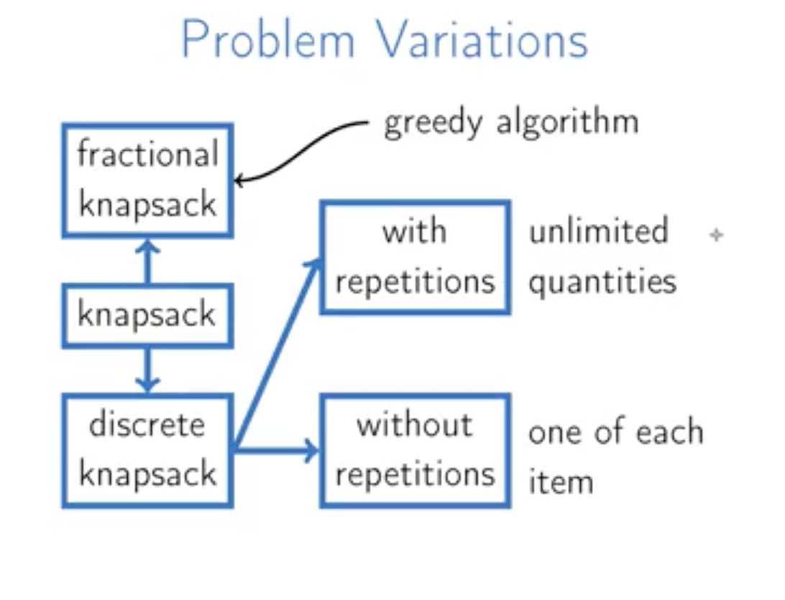
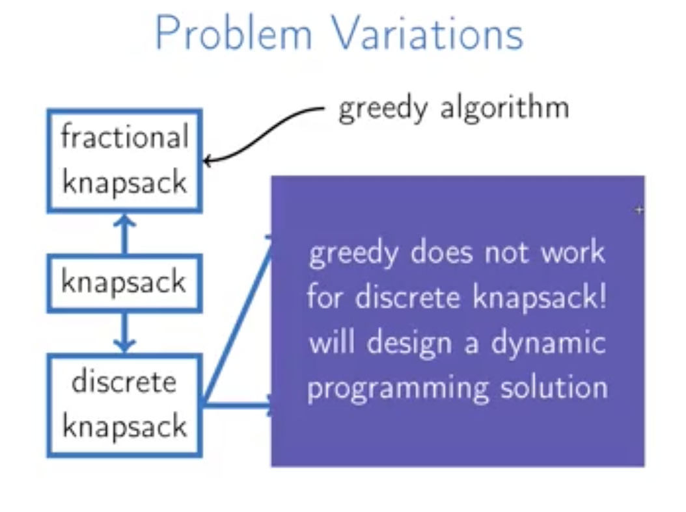
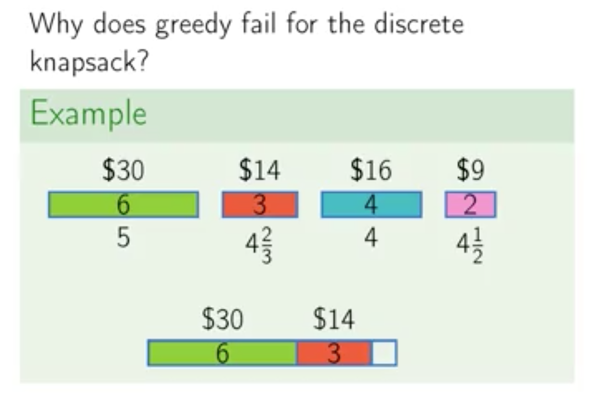
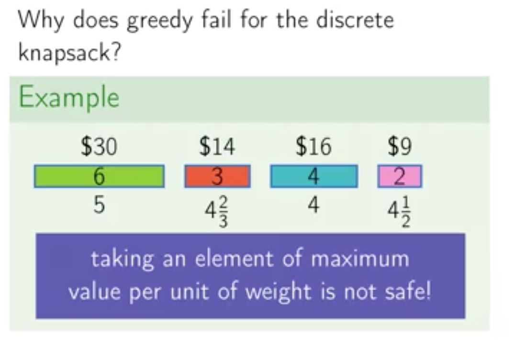
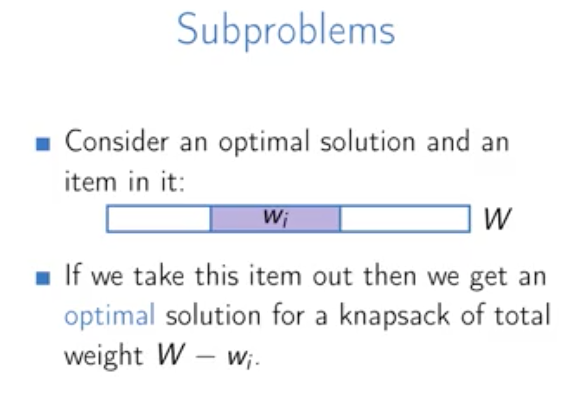
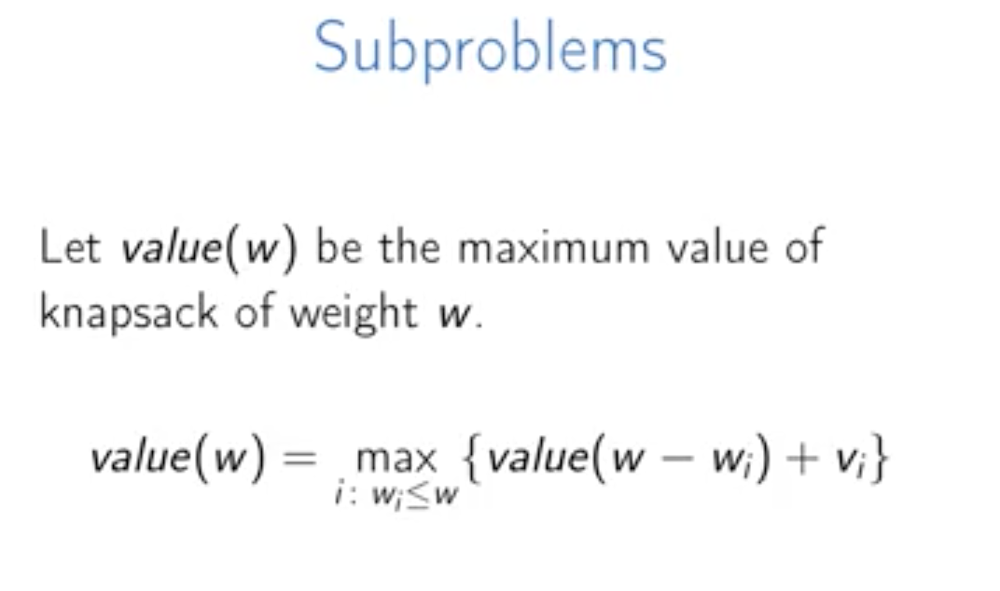
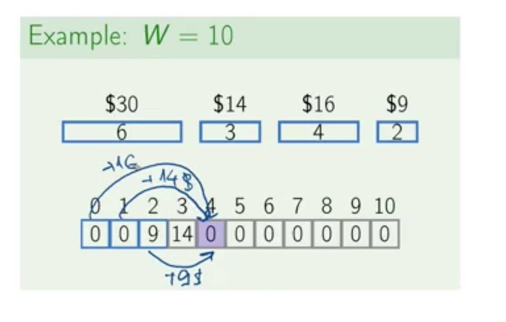
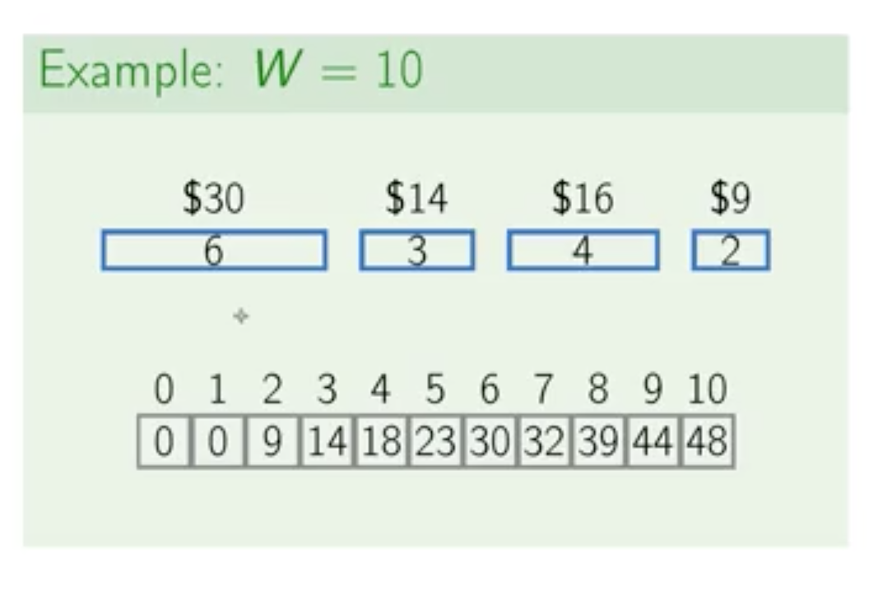

Week 5  : Dynamic Programming
======

#### Knapsack

  

在后两种的knapsack问题中，greedy algorithm不适用的原因是因为在有了 none-fraction 的限制后，greedy algorithm 会认为问题无解

  

#### Knapsack with Repetitions

###### Subproblems

这哥们讲的很明白啊，比之前那个讲的要好理解

每个动态规划问题都由许多 subproblem 构成

- greedy algorithm 是正向思维，每次我们找最合适的一个物品，直到填满
- dynamic programming 是逆向思维，也就是，我们先假设一个最优解，然后当我们拿掉一个物品后，就演变成计算W-wi 的最优解了
- 第二张图（右图），定义了一个递归问题，每个字问题都是求解一个最优问题

例子如下（右图可以验证代码实现）：

#### Knapsack without Repetitions
