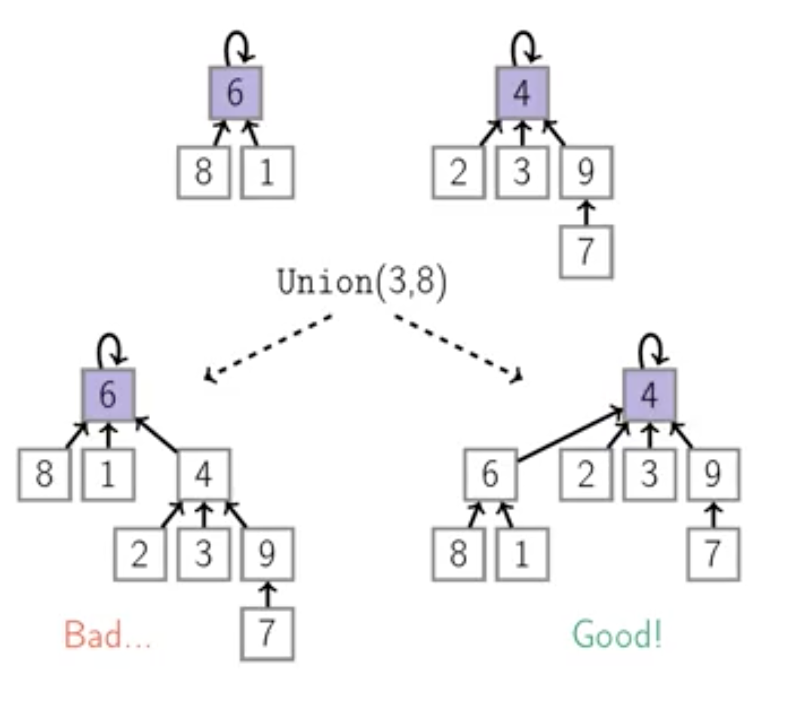

Week 2
======

Priority Queues: Heaps
----------------------

**Definition**:
> Binary max-heap is a binary-tree where the value of each node is at least the values of its children. （也就是父节点 大于等于 子节点）

> In the previous module, we defined the height of a tree as the number of nodes on a longest path from the root to a leaf. In this module, we use a slightly different definition of the height: we define it to be equal to the number of edges on the longest path from the root to a leaf.

Disjoint Sets
-------------

**Definition**:
> A disjoin-set data structure supports the following operations:

> - MakeSet(x) creates a singleton set {x}
> - Find(x) return ID of the set containing x:
> - -- if x and y lies in the same set, then Find(x) = Find(y)
> - -- otherwise, Find(x) != Find(y)
> - Union(x,y) merges two sets containing x and y

**Implementation: Tree**

> - Q: how to merge two trees?
> - A: hang one of the trees under the root of the other one
> 
> - Q: which one to hang?
> - A: a shorter one, since we would like to keep the tree shallow
>
> - When merging two trees we hang a shorter one under the root of a taller one
> - To quickly find a height of a tree, we will keep the height of each subtree in an array rank[1...n]: rank[i] is the height of the subtree whose root is i
> - hanging a shorter tree under a taller one is called a union by rank heuristic

> 
