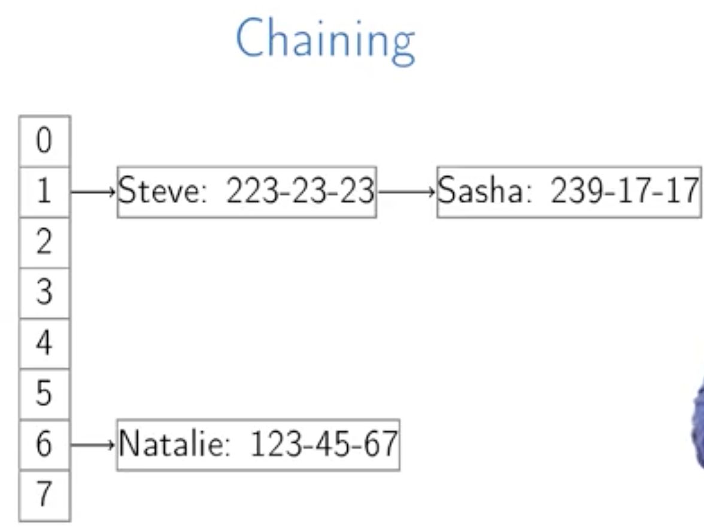
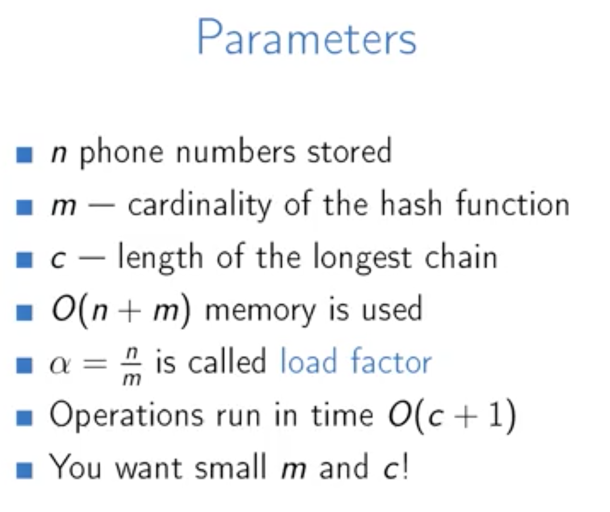
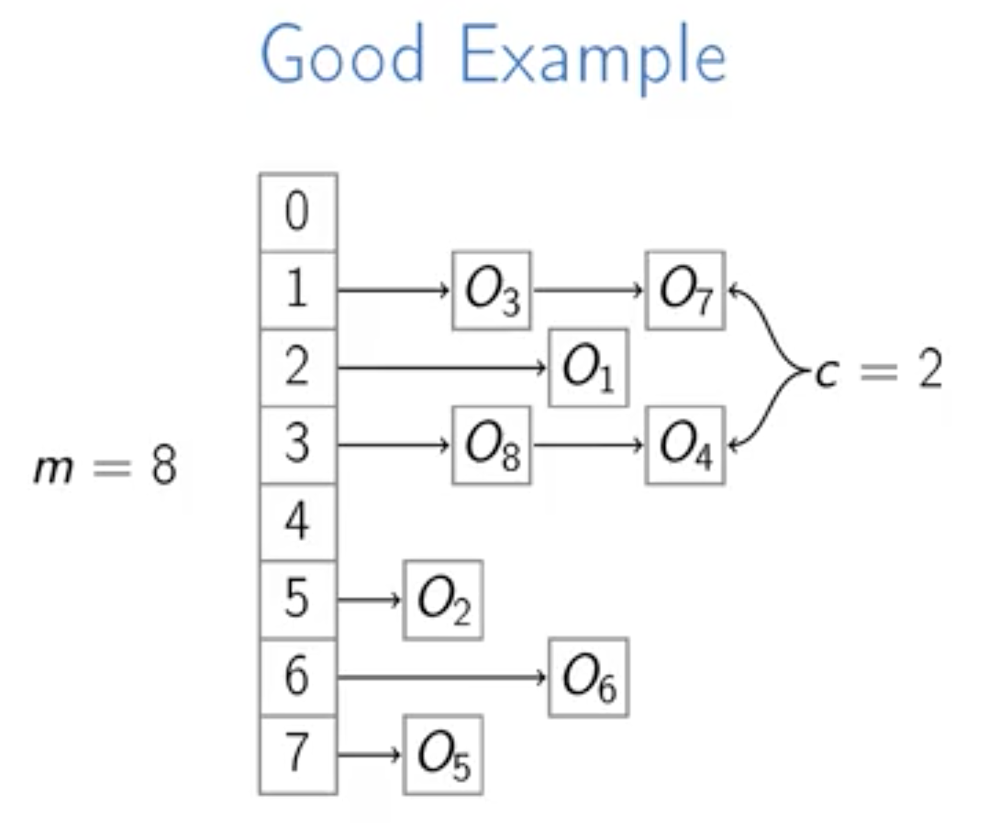
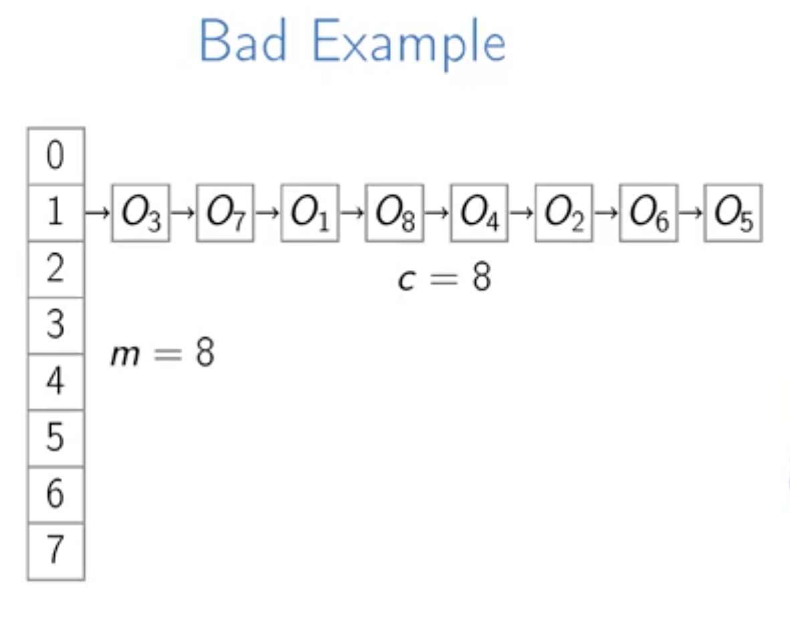

Week 3
======

Hash Tables
----------------------

**Overview**
> 密码验证也是用的 hash table, 具体是咋做到的？

**Definition**: hash function
> For any set of objects S and any integer m>0, a function h: S -> {0, 1, ... , m-1} is called a hash function.
> **m** is called the cardinalty of hash function h.  

**Desirable Properties**

> - **h** should be fast to compute
> - Different values for different objects
> - Direct addressing with O(m) memory
> - Want small cardinalty **m**
> - Impssible to have all different values if number of objects |**S**| is more than m

**Definition**: Collisions
> when h(o1)=h(o1) and o1 != o2, this is a collision.

**Definition**: Map
> Map from S to V is a data structure with methods HasKey(O), Get(O), Set(O, v), where O ∈ S, v ∈ V.

**Hash Functions**

   
