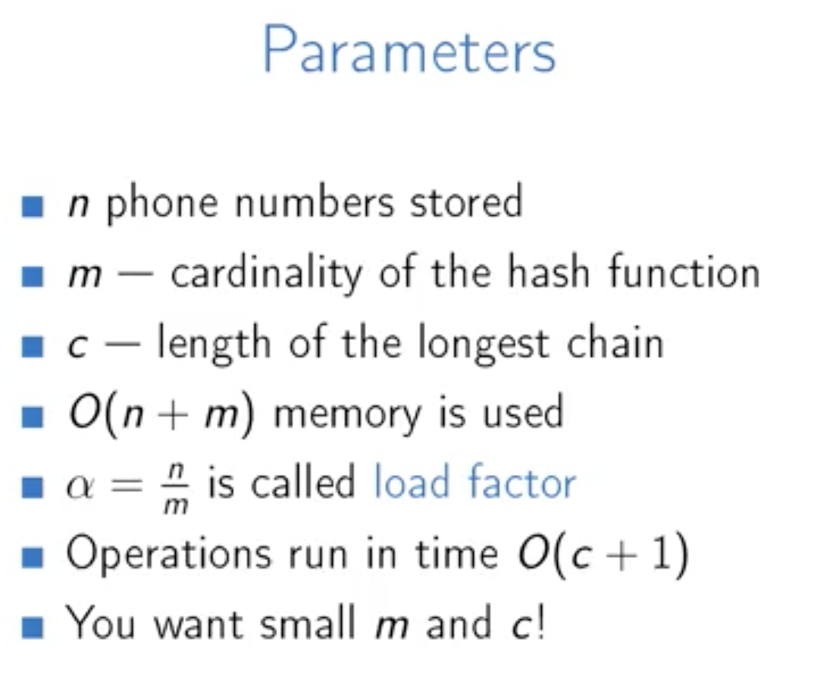
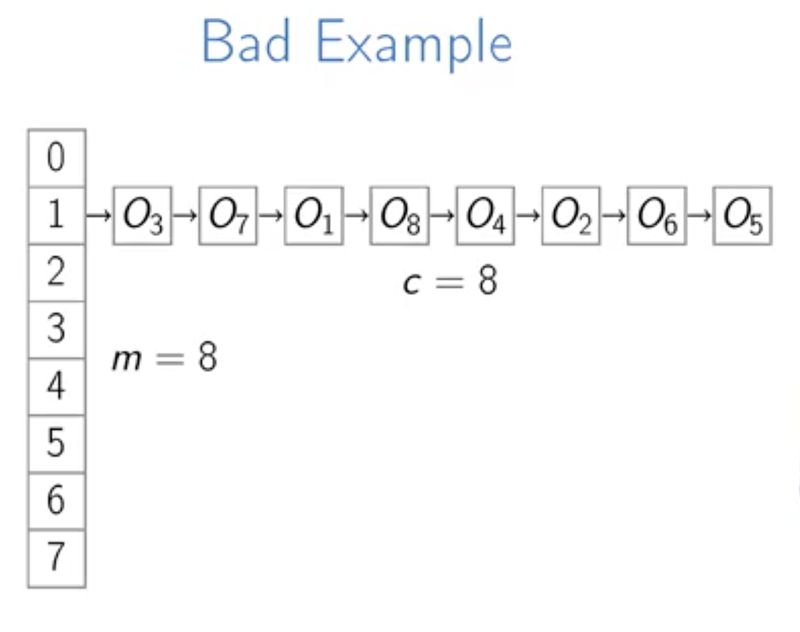

Week 4
======

Binary Search Tree
----------------------

**Property**
> X's key is larger than the key of any descendent of its left child, and smaller than the key of any descendent of its right child
> 
> 
> 

**Balance**
> Want left and right subtrees to have approximately the same size

**Desirable Properties**

> - **h** should be fast to compute
> - Different values for different objects
> - Direct addressing with O(m) memory
> - Want small cardinalty **m**
> - Impssible to have all different values if number of objects |**S**| is more than m

**Definition**: Collisions
> when h(o1)=h(o1) and o1 != o2, this is a collision.

**Definition**: Map
> Map from S to V is a data structure with methods HasKey(O), Get(O), Set(O, v), where O ∈ S, v ∈ V.

**Hash Functions**

   
