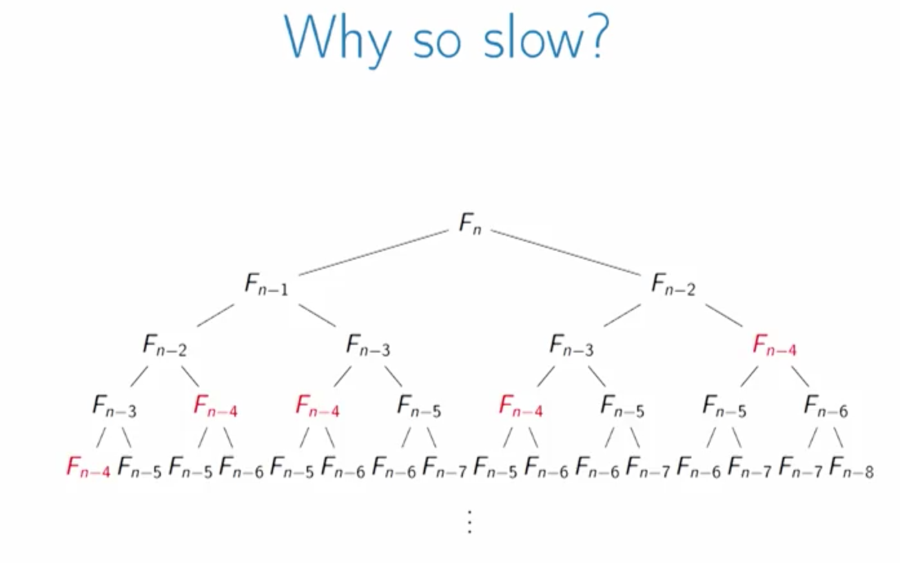
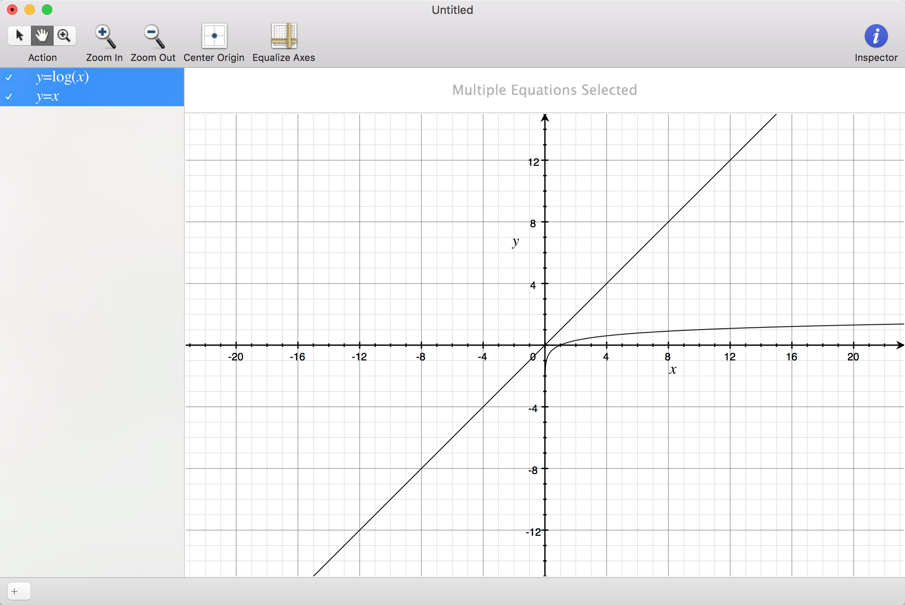
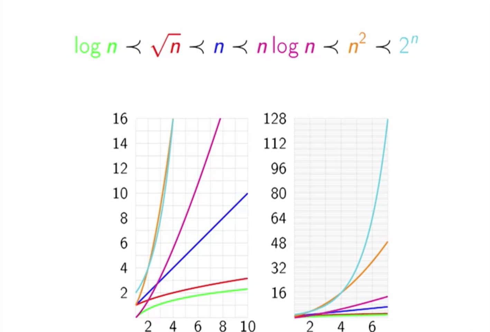

Week 2
======

在解决所有问题之前，我们首要做的是，**如何准确的定义它**

### 斐波那契数列
##### Running Time

在计算时间复杂度时，分为与迭代(即 n )有关和无关的两部分，**之所以更关注n相关的部分，是因为无论常数项有多大，当随着数据量增大，n就会超过它**，已斐波那契数列为例：
<pre><code>
> int fibcurs(int n) {
>     if (n <= 3)
>         return n;
>     else
>         return fibcurs(n-1) + fibcurs(n-2);
> }
</code></pre>

1. if 条件成立时，执行两行语句(if 判断和 return )，这是与 n 无关的， 执行次数为常量:2, 加上else的return语句一共是3次常量执行
2. 计算else中的 两个递归掉用，是与 n 有关的分别是T(n-1)和T(n-2)
3. 即 T(n) = 3 + T(n-1) + T(n-2)
4. 因此，T(n) >= Fn, Fn是数列的值，要知道 fibcurs for 50:20365011074, with time:27seconds, 用递归计算50的数列值需要27秒啊, 这个值20365011074打印出来才知道有多惊人
5. 更恐怖的是计算100的数列值，在1GHz的cpu上需要 **56年**

##### Why So Slow?

我们计算了太多重复的数值，如下图所示

递归掉用实际上是反向掉用，最后按正向的顺序计算，所以我们是不是可以直接按照正向的顺序计算(应该可以但是没有实现。。。), (视频上讲的和这个想法一样，是O(n)级的)

<!-- <video id="video" controls="" preload="none" width="500"
      <source id="mp4" src="big_buck_bunny_1080p_h264.mov" type="video/mov">
      
Your user agent does not support the HTML5 Video element.

</video> -->

### 最大公约数

利用 [Euclidean algorithm](https://en.wikipedia.org/wiki/Euclidean_algorithm)  来计算会将时间复杂度由O(n) 提高到 O(log^n), 直观的感受下log函数：

### Big-O notation

Big-O notation 描述的是算法消耗时间的sacle， 也就是随着输入数据的不断增大，话费的时间是怎样的走势, 因为当n比较小的时候，运行时间我们可以感受下，随着n不断增大，不同的模型有怎样的走势:

Definition:
> 1. f(n) = O(g(n)) (f is Big-O of g)
> 2. f<=g if there exist constants N and c so that for all n>=N, f(n)<=c*g(n)